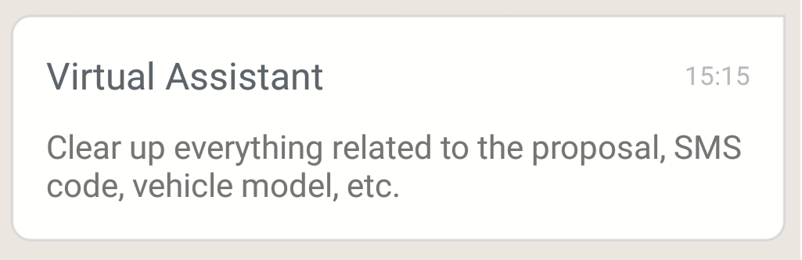
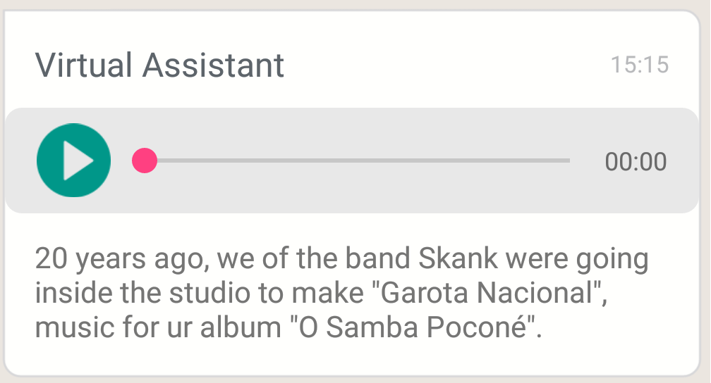
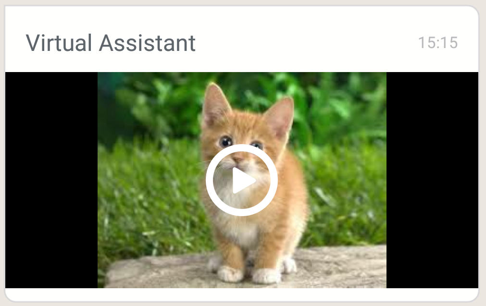
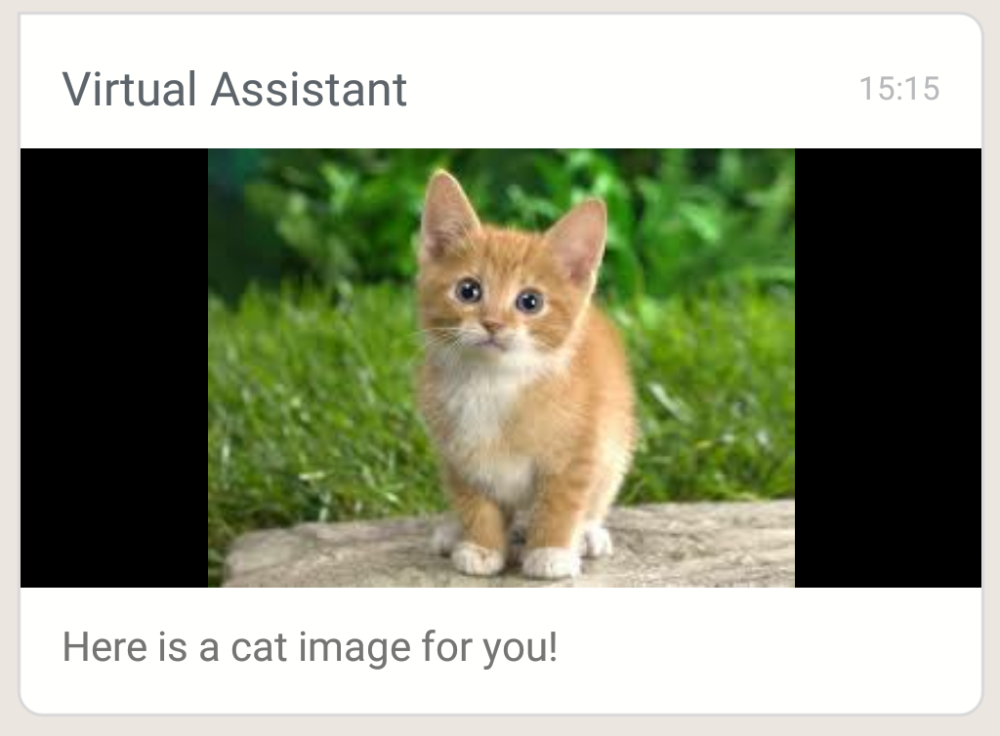
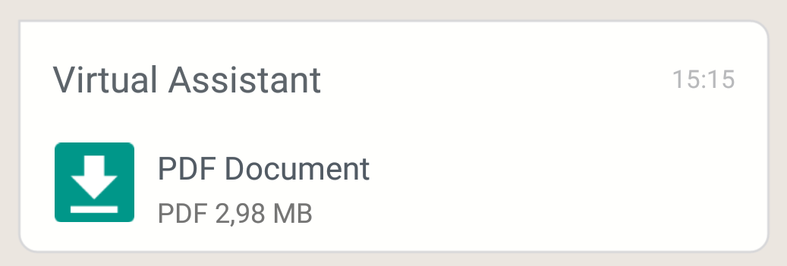
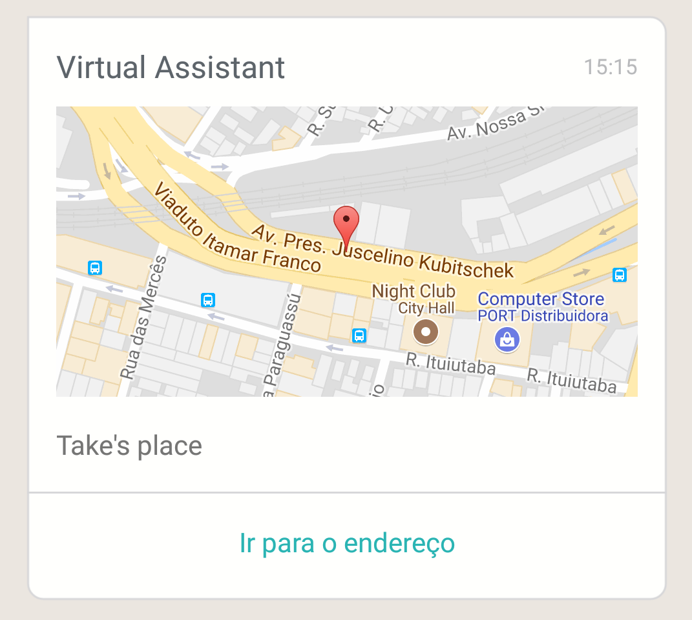
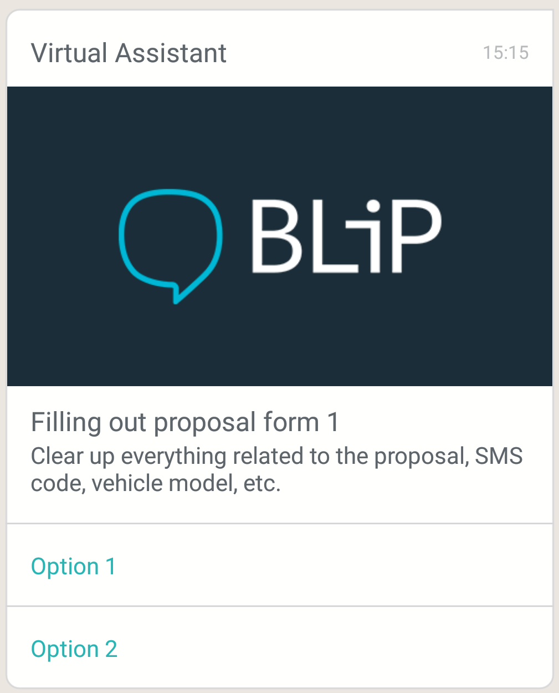
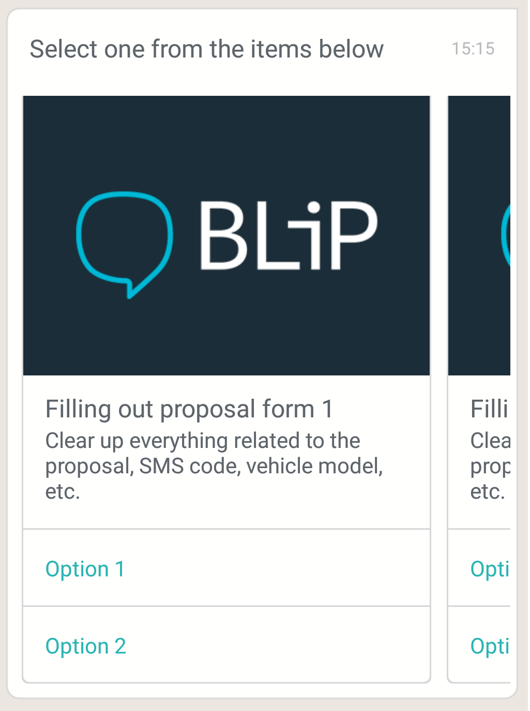
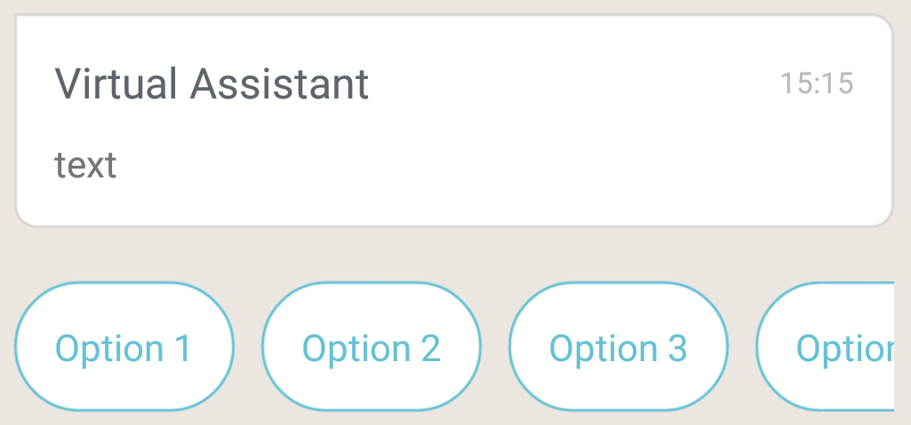

# Blip Cards for Android

## Installing the dependency

In the app's `build.gradle` file:
```
dependencies{
    ...
    compile 'ai.blip.cards:blip-cards-android:<latest-version>'
    ...
}

```

In the project's `build.gradle` file:
```
allprojects {
    repositories {
        ...
        maven { url 'https://dl.bintray.com/takenet/maven/' }
        ...
    }
}
```

# Components:

## ChatState
### Example:
Code:
```
    ChatState p = new ChatState();

    Message m = new Message();
    m.setContent(p);

    View v = new BlipCard(this)
        .right()
        .setMessage(m)
        .build();
```

Result:

 

---

## Text
### Example:
Code:
```
    PlainText p = new PlainText("Clear up everything related to the proposal, SMS code, vehicle model, etc.");

    Message m = new Message();
    m.setContent(p);

    View v = new BlipCard(this)
        .right()
        .setMessage(m)
        .setFrom("Assistente Virtual")
        .setMenuMultimediaClickListener(new MenuMultimedia.MenuMultimediaListener() {
            @Override
            public void onItemClick(DocumentSelectOption documentSelectOption, int i) {
                Toast.makeText(getBaseContext(), "" + i, Toast.LENGTH_SHORT).show();
            }
        })
        .setDateTime("15:15")
        .build();
```

Result:



---

## Media (Audio)
### Example:
Code:  
```
    MediaLink p = new MediaLink();
    p.setText("20 years ago, we of the band Skank were going inside the studio to make \"Garota Nacional\", music for our album \"O Samba Poconé\".");
    p.setType(MediaType.parse("audio/mp3"));
    p.setUri(URI.create("http://blaamandagjazzband.dk/jazz/mp3/basin_street_blues.mp3"));

    Message m = new Message();
    m.setContent(p);

    View v = new BlipCard(this)
        .left()
        .setMessage(m)
        .setFrom("Virtual Assistant")
        .setDateTime("15:15")
        .build();
```

Result:



---

## Media (Video)
### Example:
Code:  
```
    MediaLink p = new MediaLink();
    p.setType(MediaType.parse("video/mp4"));
    p.setUri(URI.create("http://clips.vorwaerts-gmbh.de/VfE_html5.mp4"));

    p.setPreviewType(MediaType.parse("image/jpeg"));
    p.setPreviewUri(URI.create("https://encrypted-tbn3.gstatic.com/images?q=tbn:ANd9GcS8qkelB28RstsNxLi7gbrwCLsBVmobPjb5IrwKJSuqSnGX4IzX"));


    Message m = new Message();
    m.setContent(p);

    View v = new BlipCard(this)
        .left()
        .setMessage(m)
        .setFrom("Virtual Assistant")
        .setDateTime("15:15")
        .build();
```

Result:



----

## Media (Image)
### Example:

Code:  
```
    MediaLink p = new MediaLink();
    p.setText("Here's a cat image for you!");
    p.setType(MediaType.parse("image/jpeg"));
    p.setUri(URI.create("http://2.bp.blogspot.com/-pATX0YgNSFs/VP-82AQKcuI/AAAAAAAALSU/Vet9e7Qsjjw/s1600/Cat-hd-wallpapers.jpg"));
    p.setPreviewType(MediaType.parse("image/jpeg"));
    p.setPreviewUri(URI.create("https://encrypted-tbn3.gstatic.com/images?q=tbn:ANd9GcS8qkelB28RstsNxLi7gbrwCLsBVmobPjb5IrwKJSuqSnGX4IzX"));

    Message m = new Message();
    m.setContent(p);

    View v = new BlipCard(this)
        .left()
        .setMessage(m)
        .setFrom("Virtual Assistant")
        .setDateTime("15:15")
        .build();
```

Result:  



---

## Media (Document)
### Example:
Code:  
```
    MediaLink p = new MediaLink();
    p.setSize(new Long(3124123));
    p.setText("Document PDF");
    p.setType(MediaType.parse("application/pdf"));
    p.setUri(URI.create("https://s3-sa-east-1.amazonaws.com/i.imgtake.takenet.com.br/d6ztq/d6ztq.pdf"));

    Message m = new Message();
    m.setContent(p);

    View v = new BlipCard(this)
        .left()
        .setMessage(m)
        .setFrom("Virtual Assistant")
        .setDateTime("15:15")
        .build();
```

Result:
  


---

## Location
### Example:

Code:  
```
    Location p = new Location();
    p.setText("Take's place");
    p.setLatitude(-19.918899);
    p.setLongitude(-43.959275);

    Message m = new Message();
    m.setContent(p);

    View v = new BlipCard(this)
        .left()
        .setMessage(m)
        .setFrom("Virtual Assistant")
        .setLocationClickListener(new ai.blip.cards.controls.Location.LocationListener() {
            @Override
            public void onLocationClick(Location l) {
                Toast.makeText(getBaseContext(), "LocationClick " + l.getLatitude() + "," + l.getLongitude(), Toast.LENGTH_SHORT).show();
            }
        })
        .setDateTime("15:15")
        .build();
```

Result:



---

## Web Link
### Example:
Code:
```
    WebLink p = new WebLink();
    p.setText("text");
    p.setTitle("title");
    p.setUri(URI.create("http://www.uol.com.br"));

    Message m = new Message();
    m.setContent(p);

    View v = new BlipCard(this)
        .right()
        .setMessage(m)
        .setFrom("Virtual Assistant")
        .setMenuMultimediaClickListener(new MenuMultimedia.MenuMultimediaListener() {
            @Override
            public void onItemClick(DocumentSelectOption documentSelectOption, int i) {
                Toast.makeText(getBaseContext(), "" + i, Toast.LENGTH_SHORT).show();
            }
        })
        .setDateTime("15:15")
        .build();
```

Result:


---

## Multimedia Menu
### Example:

Code:  
```
    Message m = new Message();
    m.setContent(createSelect("Filling out proposal form",
    "Clear up everything realted to the proposal, SMS code, vehicle model, etc.",
    "http://files.lojas.club/blip.png"));

    View v = new BlipCard(this)
        .right()
        .setMessage(m)
        .setFrom("Assistente Virtual")
        .setMenuMultimediaClickListener(new MenuMultimedia.MenuMultimediaListener() {
            @Override
            public void onItemClick(DocumentSelectOption documentSelectOption, int i) {
                Toast.makeText(getBaseContext(), "" + i, Toast.LENGTH_SHORT).show();
            }
        })
        .setDateTime("15:15")
        .build();
```

Result:



---

## Carousel
### Example:
Code:  
```
    Message m = new Message();

    DocumentCollection docCol = new DocumentCollection();

    Document[] docs = new Document[3];
    docs[0] = createSelect(
        "Filling out proposal form 1",
        "Clear up everything realted to the proposal, SMS code, vehicle model, etc.",
        "http://files.lojas.club/blip.png");
    docs[1] = createSelect(
        "Filling out proposal form 2",
        "Clear up everything realted to the proposal, SMS code, vehicle model, etc.",
        "http://files.lojas.club/blip.png");
    docs[2] = createSelect(
        "Filling out proposal form 3",
        "Clear up everything realted to the proposal, SMS code, vehicle model, etc.",
        "http://files.lojas.club/blip.png");

    docCol.setItems(docs);

    m.setContent(docCol);

    View v = new BlipCard(this)
        .right()
        .setMessage(m)
        .setFrom(getString(R.string.virtual_assistant))
        .setCaroulselClickListener(new Carousel.CarouselListener() {
            @Override
            public void onItemClick(int i, DocumentSelectOption documentSelectOption, int i1) {
                Toast.makeText(getBaseContext(), "Menu: " + i + " option: " + i1, Toast.LENGTH_SHORT).show();
            }
        })

        .setFrom("Select one from the items below:")
        .setDateTime("15:15")
        .build();
```

Result:



---

## Quick Reply
### Example:
Code:
```
    Select p = new Select();
    p.setText("Text");

    SelectOption[] options = new SelectOption[4];
    SelectOption op1 = new SelectOption();
    op1.setText("Option 1");
    options[0] = op1;
    SelectOption op2 = new SelectOption();
    op2.setText("Option 2");
    options[1] = op2;
    SelectOption op3 = new SelectOption();
    op3.setText("Option 3");
    options[2] = op3;
    SelectOption op4 = new SelectOption();
    op4.setText("Option 4");
    options[3] = op4;

    p.setOptions(options);

    Message m = new Message();
    m.setContent(p);

    View v = new BlipCard(this)
        .left()
        .setMessage(m)
        .setFrom("Assistente Virtual")
        .setQuickReplyListener(new QuickReply.QuickReplyListener() {
            @Override
            public void onItemClick(SelectOption selectOption, int i) {
                Toast.makeText(getBaseContext(), "" + selectOption.getText(), Toast.LENGTH_SHORT).show();
            }
        })
        .setDateTime("15:15")
        .build();
```

Result:

